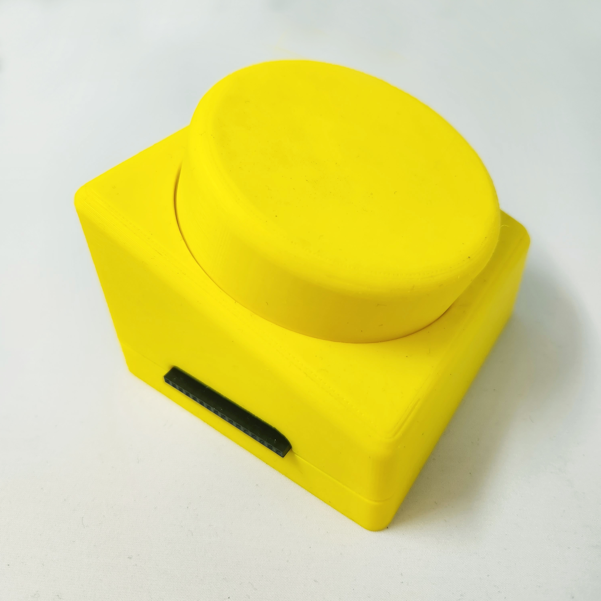

# Loom Pedals

The Loom Pedals system is an open-source modular hardware/software interface for Jacquard weavers, designed to enable improvisation and live creative experimentation at the loom. The Pedals integrate with AdaCAD, open-source weaving design software.

 

## Repositories

[Enclosure](https://github.com/UnstableDesign/Loom-Pedals-Hardware/)

[Printed Circuit Board](https://github.com/UnstableDesign/Loom-Pedals-Hardware/)

[TC2 Driver Software](https://github.com/UnstableDesign/Loom-Pedals-Raspberry-Pi)

[AVL Driver Software](https://github.com/sminliwu/AdaCAD-Jacq3G)

[Design Software Interface](https://github.com/UnstableDesign/Loom-Pedals-AdaCAD)

## [Project Overview](sections/overview.md)